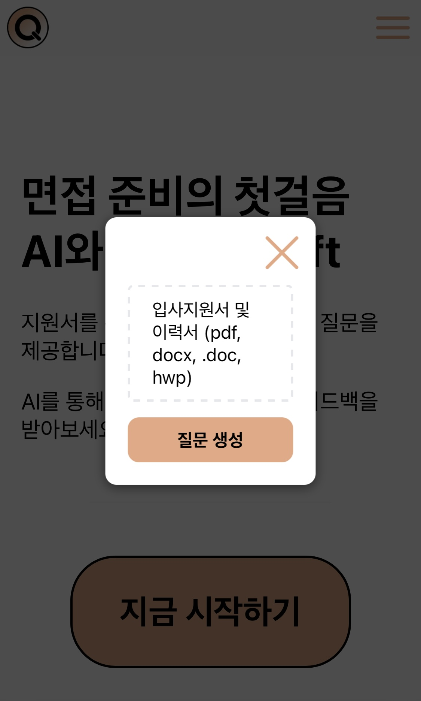

# Qcraft front-end

<!-- ### <a href="https://www.qcraft.site">서비스 링크</a> -->
### <a href="https://qcraft-yps-projects-9c16939f.vercel.app">서비스 링크</a> - 현재 서버 내려둠

### <a href="https://github.com/Capstone-QCraft">프로젝트 협업 레포지토리</a>

## 서비스 화면

### 로그인

<table border="1">
    <tr>
        <th style="text-align: center;">Desktop (Light)</th>
        <th style="text-align: center;">Desktop (Dark)</th>
        <th style="text-align: center;">Mobile (Light)</th>
        <th style="text-align: center;">Mobile (Dark)</th>
    </tr>
    <tr>
        <td>
            
        </td>
        <td>
            
        </td>
        <td>
            
        </td>
        <td>
            
        </td>
    </tr>
</table>

### 회원가입

<table border="1">
    <tr>
        <td>
            
        </td>
        <td>
            
        </td>
        <td>
            
        </td>
        <td>
            
        </td>
    </tr>
</table>

### 메인화면

<table border="1">
    <tr>
        <td>
            
        </td>
        <td>
            
        </td>
        <td>
            
        </td>
        <td>
            
        </td>
    </tr>
</table>

### 모바일 navbar

<table border="1">
    <tr>
        <td>
            
        </td>
        <td>
            
        </td>
    </tr>
</table>

### 파일 입력 모달

<table border="1">
    <tr>
        <td>
            
        </td>
        <td>
            
        </td>
        <td>
            
        </td>
        <td>
            
        </td>
    </tr>
</table>

### 인터뷰

<table border="1">
    <tr>
        <td>
            
        </td>
        <td>
            
        </td>
        <td>
            
        </td>
        <td>
            
        </td>
    </tr>
</table>

### 리뷰

<table border="1">
    <tr>
        <td>
            
        </td>
        <td>
            
        </td>
        <td>
            
        </td>
        <td>
            
        </td>
    </tr>
</table>

### 기록

<table border="1">
    <tr>
        <td>
            
        </td>
        <td>
            
        </td>
        <td>
            
        </td>
        <td>
            
        </td>
    </tr>
</table>

### 내정보

<table border="1">
    <tr>
        <td>
            
        </td>
        <td>
            
        </td>
        <td>
            
        </td>
        <td>
            
        </td>
    </tr>
</table>
